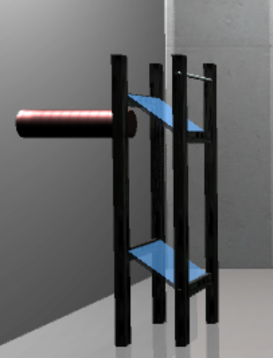
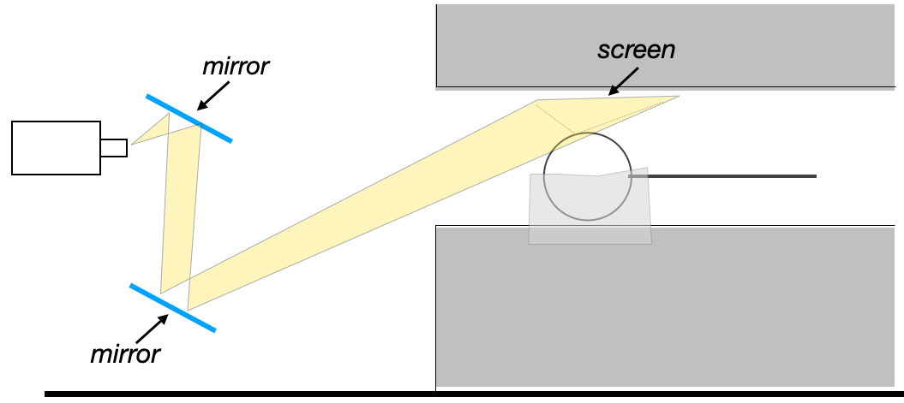

#### **MRI Room and Constraints**
-  The Harvard CBS Neuroimaging facility relies on a LCD projector that is placed  on a stable table outside the shielded scanner room. In most visual experiments, images are projected onto a screen at the back of the bore that is viewed via a small mirror positioned above the subject’s eyes.
-  To increase the spatial extent of stimulus, our goal was to project onto the inner wall of the cylinder bore. This simple idea is constrained by both physical and organizational limitations.
-  The MRI serves many labs. Any alterations must be minimally intrusive so as not to alter the operation of any other ongoing study. Practically, this meant that we were discouraged from attaching anything, such as a uniform diffusive screen, to the scanner bore.
-  We could not add structures to the space behind the scanner that would alter access to the space. Introducing a second projection system into the setup was not encouraged.

    
    <figcaption style="text-align: center;"><em>General geometry of the room and our projection path</em></figcaption>

 
- - -
#### **Our Approach**
-  Mirrors
    -  We constructed an inverted periscope from a pair of front surface mirrors supported on a non-ferromagnetic stand. The lower mirror remains fixed, the upper mirror is hinged.
    -  Tilting the mirror up removes the periscope from the projection path.
    -  With the periscope in place, the projector appears to originate from a virtual point further back and below the floor of the room.

    
    <figcaption style="text-align: center;"><em>A periscope stand with lower and upper mirrors</em></figcaption>

 
-  Potential Projection Paths
    -  Ideally, the projector would be incident on the screen at 90 degrees. The physical geometry of the scanner bore makes this near impossible. 
    -  The next best solution would be to place the projector (or the final mirror) closer to the cylinder bore in order to obtain the steepest angle possible. We did not pursue this route for the reasons mentioned above.
    -  If we projected directly onto the MRI bore, the light rays would be incident at just over 18 degrees. This shallow angle results in large distortion along the vertical (Y) axis of the projected image. 
    -  To somewhat mitigate this, we angled the projection screen. Rather than being parallel to the magnet bore, we tilted it by 10 degrees.
    -  The edge of the screen at the top of the subject’s head nearly touches the bore. The screen edge near their collarbone is closer to the subject than the bore. Tilting angles larger than 10 degrees were ruled out for reasons of comfort- eye strain, feelings of confinement, etc.

 
-  Determined Projection Setup
    -  The net result is that that projector is angled at just over 28 degrees relative to the screen.
    -  As a result approximately 1⁄3 of the Y pixels of the projector fall onto the screen, limiting our vertical resolution to 284 pixels rather than the native 768.
    -  The total screen extends over 2.3 degrees. The ultra long throw lens we used, ratio=9, creates an image that spans 4.8 degrees.
    -  _**Note**_ : The current limits on the low resolution (i.e., number of pixels projected onto a screen) can be overcome by our new projector that has a much higher maximum resolution (4k). 

    
    <figcaption style="text-align: center;"><em>Image projection path</em></figcaption>

