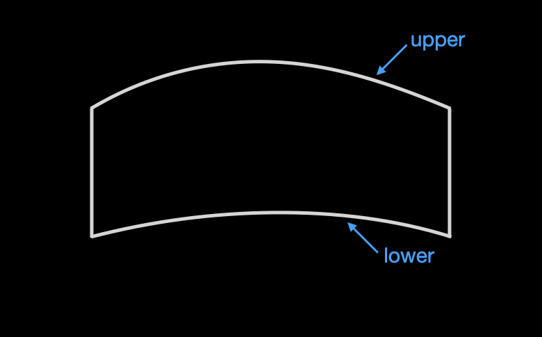
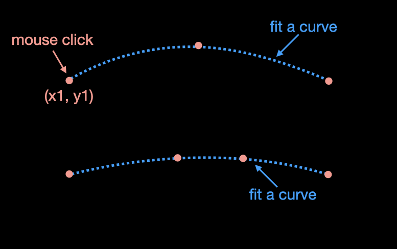
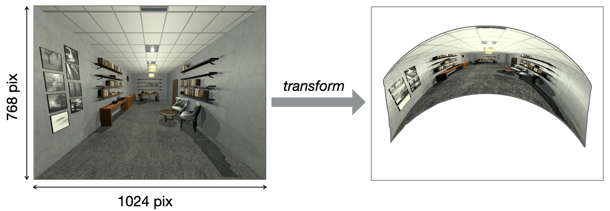

#### **Problems and Goals**
-  Due to physical constraints of scanner room (e.g., location of projector, projection angle), only a part of display pixels (currently about 30%) can be projected onto a screen, and the rest of pixels fall outside of the screen. Thus, it is crucial to know which pixels are actually usable for presenting stimuli. 
-  A regular image looks distorted, because the screen is curved and tilted from a participant’s eyes. Thus, a projected image needs to be warped in a reverse direction, such that the image on the curved screen looks “normal”. 

 
#### **Compute the shape of screen**
<figure style="display: flex; align-items: center;">
  

    
    <!-- <figcaption style="text-align: center;"></figcaption> -->
  

  

    
    <!-- <figcaption style="text-align: center;">Back</figcaption> -->
  

</figure>

-  Get 3 or more coordinates (dots) along a horizontal axis of the screen using mouse clicks.  
-  Using those dot coordinates, fit a curve. 
-  Compute the curvature separately for upper and lower screen boundary as the curvature is slightly different. 
-  Compute the curvature of horizontal lines between the upper and lower boundary by interpolating them. 
-  This step results in the shape of screen, described in terms of coordinates within the display resolution. 

 
#### **Map input image to the screen shape**
-  Now we have the number of usable pixels (i.e., can be projected onto the screen) for each X and Y axis.
-  However, the number of those pixels will be lower than the original input image. Thus, we need to downsample the input image. 
-  This step results in the mapping function indicating which pixel in the input image should be mapped onto a pixel in the output image (curved screen). 

    
    <figcaption style="text-align: center;"><em>Image Warping Example</em></figcaption>

  
- - - - 
#### **Warping Code**

-  The code for image warping is available on GitHub. 
-  Click [HERE](https://github.com/jpark203/FullField-ImageWapring.git) 
