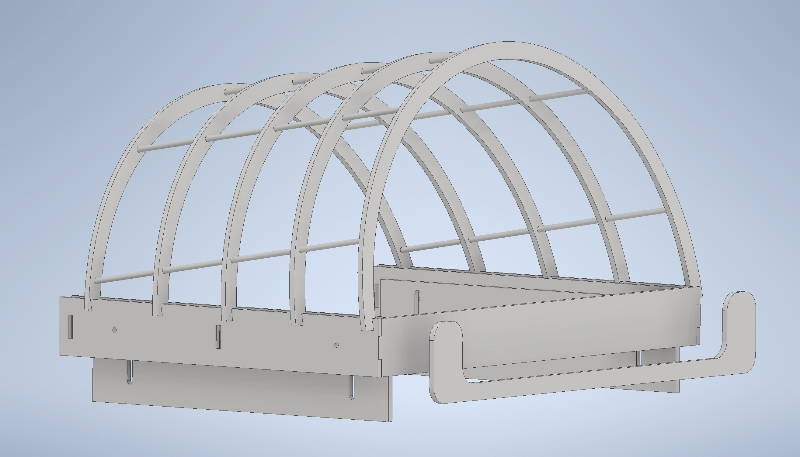
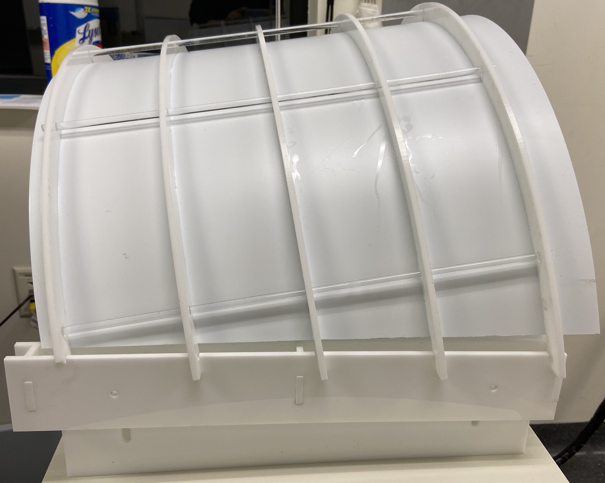
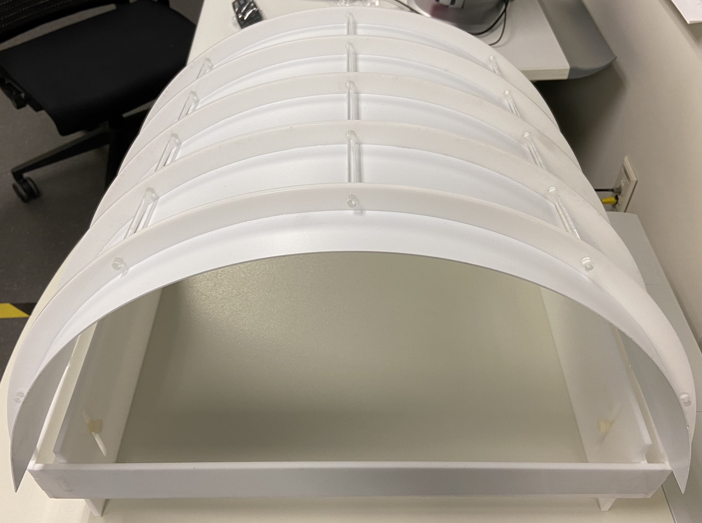

<blockquote style="background-color: #f2e6ff;">
<strong><em>Key Idea</em></strong> : 
Get the maximum screen real estate for a given scanner bore size, with constraints that 1) the screen must remain stable against the scanner vibration, 2) image should look crisp and clear, and 3) the screen should be easy to setup and remove.
</blockquote>

 
#### **Design**

    
    <figcaption style="text-align: center;"><em>Screen hull</em></figcaption>

-  The screen was held in shape by gluing it to a using a custom fabricated acrylic “hull” that could be placed over the subject’s head and guided into the bore with them.

-  Design Files: download
[.ipt](../designFiles/2020FlatDesign.ipt)
,
[.dxf](../designFiles/screenHull.dxf)
    -  The original back brace cast an unwanted shadow and was replaced with the lower profile one shown floating in front. A new back bracket, consistent with this design, has been added to the dxf file. 

<!-- <a href="https://github.com/jpark203/fullfield-neuroimaging/raw/main/designFiles/2020FlatDesign.ipt" download> .ipt</a>
,
<a href="https://github.com/jpark203/fullfield-neuroimaging/raw/main/designFiles/screenHull.zip" download> .dxf(in zip) </a> -->
    
    
    
  
- - -
#### **Materials**
-  Screen Sheet (not shown): [polystyrene](https://www.mcmaster.com/8734K39/)
    -  Any material is fine. 
    -  We found some plastics had a green fluorescence when illuminated by the projector. Polystyrene did not, resulted in a reasonably crisp image and was easily glued to the hull ribs. 

-  Screen Hull: white acrylic 1/4'' (6mm)
    -  Any non-magnetic material can work. We chose acrylic becasue it was easy to iterate prototypes with our laser cutter. 

-  Plastic Rod: 1/4' [polystyrene rod](https://www.mcmaster.com/8720K32/) 
    -  The rod is passed through hull ribs to maintain spacing and enforce rigidity. 
    -  Any plastic should be fine. 

-  Glue: acrylic solvent (Weld-On #3 or #16)

-  Adjustable "legs": attached with 1/4''-20 nylon screws 
    -  Hull is tapped. 
    -  The legs slot into the MRI bed. 

  
- - -
#### **Screen Images**
<figure style="display: flex; align-items: center;">
  

    
    <figcaption style="text-align: center;">Side</figcaption>
  

  

    
    <figcaption style="text-align: center;">Back</figcaption>
  

</figure>
