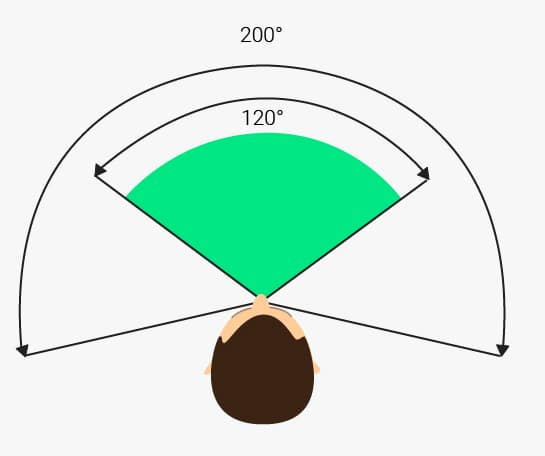
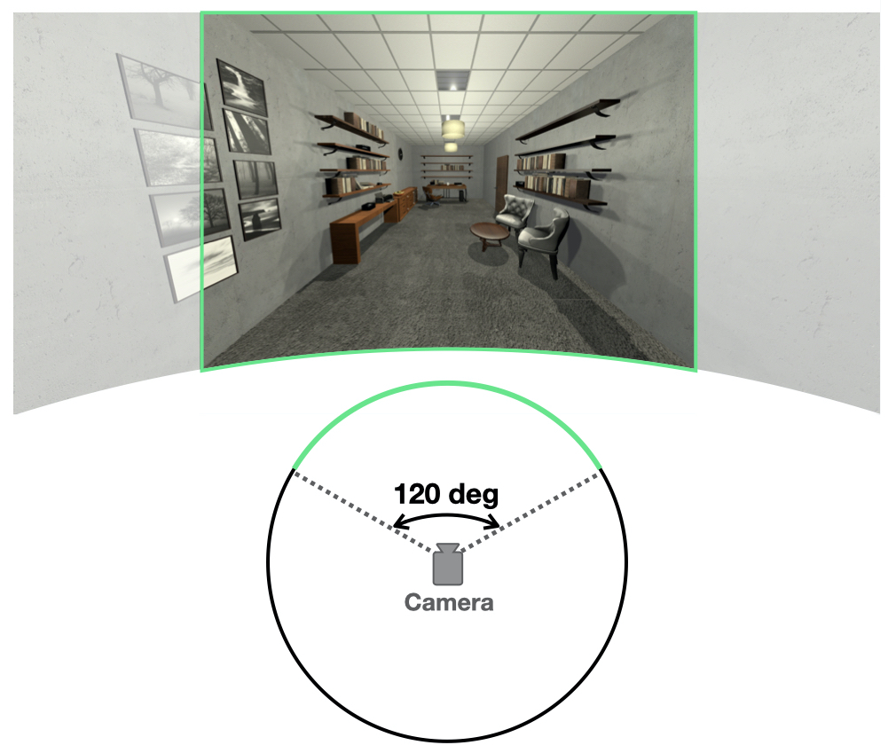

<blockquote style="background-color: #f2e6ff;">
<strong><em>Key Idea</em></strong> : 
Images should have compatible properties (e.g., field-of-view, height of camera) to avoid perceptual distortions of space. 
</blockquote>

 
-  The compatible Field-of-View (FOV) was crucial for a wide screen. 
    -  The Field-of-View is the angular extent of the world that can be seen at any given moment. It can be mesured horizontally or vertically. 
    -  Typically, humans have a binocular FOV of around 120 deg horizontally. 
    

        
        <figcaption><em>Horizontal FOV</em></figcaption>
    

    -  However, when taking a picture, the FOV can be varied across a wide range, depending on the camera settings. 
    -  When an image taken with a narrow FOV is projected onto a much wider screen (e.g., our custom-built screen), viewers are prone to experience distortions of space. 

 
-  How do we ensure the wide FOV for stimuli? 
    -  We took advantage of virtual reality (VR) game engine, where we have a complete control over the FOV and other camera parameters. 
    -  The camera FOV was set at 120.2 deg horozontally and 105 deg vertically. 
    

        
        <figcaption><em>Horizontal FOV in VR</em></figcaption>
    

    -  This FOV was chosen based on the chord angle of our physical screen (120 deg) and empirical testing by experimenters. 
    -  Since there was no ground truth for the size of VR environments (e.g., how large the space should be), experimenters compared a few different FOVs and made subjective judgements on which parameter feels most natural. 

 
-  Other camera parameters were also set to mimic the view of an adult standing in a room looking at the object on the back counter/surface. 
    -  E.g., the height was set to be 1.6 (arbitrary units), and the angle was tilted down (about 5.2 deg) such that the center object was always at the center of the image. 
    -  Note that these parameter values are specific to our VR environments.
    -  With these camera parameters, we rendered an image view for each VR environment. 
    -  The captured images were 1024 x 768 pixels 2D images, and later computationally warped before the projection. 

 
- - -

<!--   -->
-  All VR environments were generated using the Unity game engine (Version 2017.3.0).
    -  All rooms had the same physical dimensions (4 width x 3 height x 6 depth arbitrary units).
    -  Each environment has an extended horizontal surface along the back wall, containing a centrally positioned object. Then, the room was additionally populated with the kinds of objects typically encountered in those locations, creating naturalistic computer generated images. 
    -  These environments were also used in Park, Josephs, & Konkle 
    ([2021](https://psyarxiv.com/84exs);
    [2022](https://konklab.fas.harvard.edu/Papers/Park_2022_SciReports.pdf)). 
