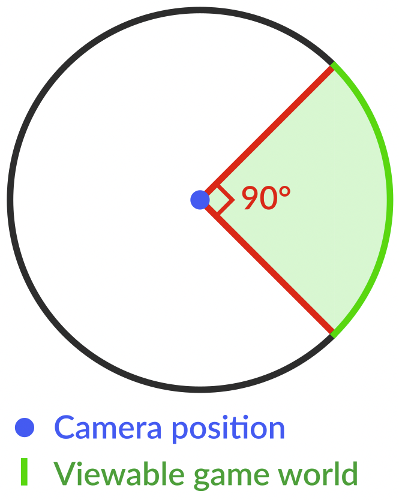
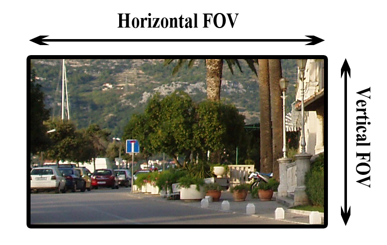

<blockquote style="background-color: #f2e6ff;">
<strong><em>Key Idea</em></strong> : 
Images should have compatible properties (e.g., field-of-view, height of camera) to avoid perceptual distortions of space. 
</blockquote>

 
-  The compatible Field-of-View (FOV) was crucial for a wide screen. 
    -  If an image with narrow FOV was projected onto the screen, viewers were prone to experience distortions of space. 

    <figure style="display: flex; align-items: center;">
    

        
        <!-- <figcaption style="text-align: center;"></figcaption> -->
    

    

        
        <!-- <figcaption style="text-align: center;"></figcaption> -->
    

    </figure>

    -  We set the camera FOV at 120.2 width x 105 height degrees in virtual reality (VR) environments. 
    -  This FOV was chosen based on the chord angle of our physical screen (120 deg) and empirical testing by experimenters. 
    -  Since there was no ground truth for the size of VR environments (e.g., how large the space should be), experimenters compared a few different FOVs and made subjective judgements on which parameter feels most natural. 

 
-  Other camera parameters were also set to mimic the view of an adult standing in a room looking at the object on the back counter/surface. 
    -  The height was set to be 1.6 (arbitrary units), and the angle was tilted down (about 5.2 deg) such that the center object was always at the center of the image. 
    -  With these camera parameters, we rendered an image view for each VR environment. 
    -  The captured images were 1024 x 768 pixels 2D images, and later computationally warped before the projection. 

 
-  All VR environments were generated using the Unity game engine (Version 2017.3.0).
    -  All rooms had the same physical dimensions (4 width x 3 height x 6 depth arbitrary units).
    -  Each environment has an extended horizontal surface along the back wall, containing a centrally positioned object. Then, the room was additionally populated with the kinds of objects typically encountered in those locations, creating naturalistic computer generated images. 
    -  These environments were also used in Park, Josephs, & Konkle 
    ([2021](https://psyarxiv.com/84exs);
    [2022](https://konklab.fas.harvard.edu/Papers/Park_2022_SciReports.pdf)). 

