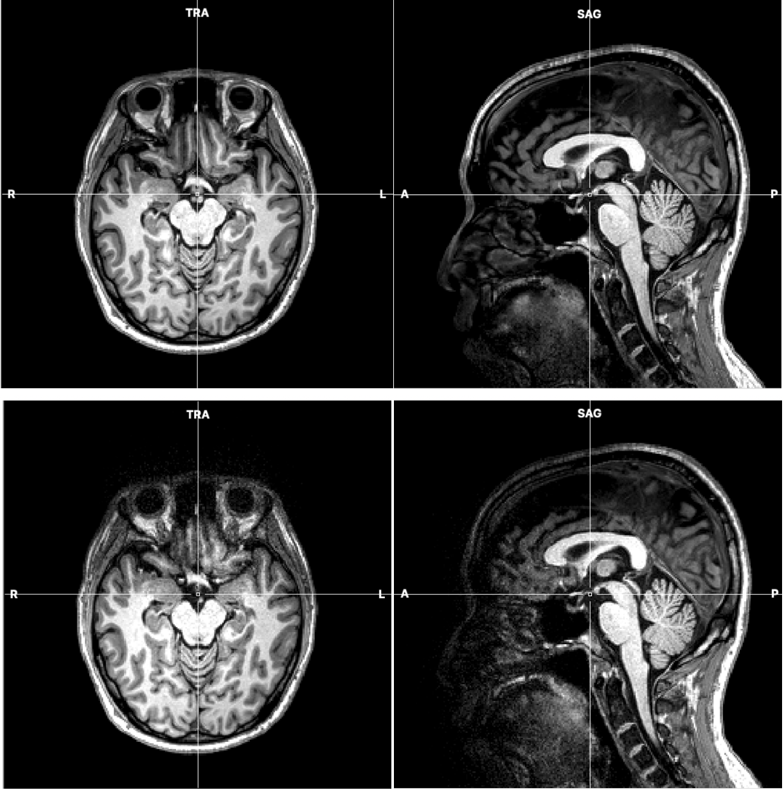

<blockquote style="background-color: #f2e6ff;">
<strong><em>Key Idea</em></strong> : 
Assess impact of removing the top head-coil on MRI signal quality, by running the same protocol twice: with and without the top head-coil. </blockquote>

 
#### **SNR maps (impacts on the anatomical image)**
-  We ran a special sequence designed for quality assessment (QA) of the head coils. 
-  It produced pure image signal-to-noise ratio (SNR) maps from each of principal axes, which is nominally signal divided by the noise. 
-  Qualitatively, the image SNR in the posterior part of brain was barely affected, and the resulting T1-weighted images confirmed this. 

    <figure style="display: flex; align-items: center;">
    

        
        <figcaption style="text-align: center;">SNR maps</figcaption>
    

    

        
        <figcaption style="text-align: center;">T1-weighted</figcaption>
    

    </figure>

 
#### **tSNR Images (impacts on the functional scans)**
-  We ran one of our BOLD scans (functional category localizer) with the exact parameters to get tSNR. This measure is important for BOLD sensitivity as it shows an ability to detect changes during the time course of the scan. 
-  The acquired data were preprocessed, brain-masked, then the mean and standard deviation images were calculated. The tSNR image was obtained from dividing the mean by standard deviation. 
-  To compare only brain areas acquired predominantly by the bottom head-coil only, we created a mask. In the bottom head-coil only tSNR image, we selected areas above the chosen threshold (tSNR = 25), then masked the with top head-coil tSNR image with the selection. 
-  The resulting average tSNR values were 34.9 without the top head-coil and 48.1 with the top head coil. 
    

        
        <figcaption style="text-align: center;"><em>tSNR images, with (bottom) and without the top head-coil (top)</em></figcaption>
    

 
#### **MRI Data Acquisition Parameters**
-  All neuroimaging data were collected at the Harvard Center for Brain Sciences using a 32-channel phased-array head coil with a 3T Siemens Prisma fMRI Scanner. 
-  High-resolution T1-weighted anatomical scans were acquired using a 3D multi-echo MPRAGE protocol [53] (176 sagittal slices; FOV = 256 mm; 1x1x1 mm voxel resolution; gap thickness = 0 mm; TR = 2530 ms; TE = 1.69, 3.55, 5.41, and 7.27 ms; flip angle = 7°). 
-  Blood oxygenation level-dependent (BOLD) contrast functional scans were obtained using a gradient echo-planar T2* sequence (87 oblique axial slices acquired at a 25° angle off of the anterior commissure-posterior commissure line; FOV = 211 mm; 1.7×1.7×1.7 mm voxel resolution; gap thickness = 0 mm; TR = 2000 ms; TE = 30 ms, flip angle = 80°, multi-band acceleration factor = 3, in-plane acceleration factor = 2) 
